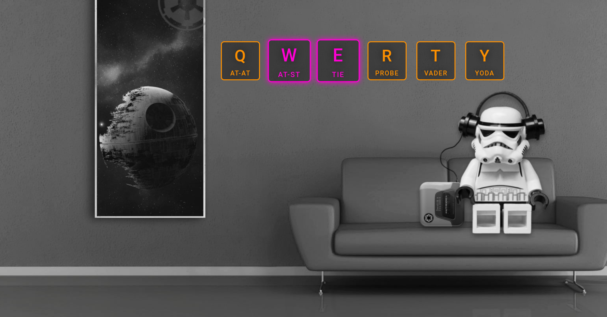

### star_wars_keys || project-001
#### description
+ a simple vanilla HTML/CSS/JS application that plays sounds after certain keydowns.
+ the keys are linked to audio files using the `data-key` attribute.
+ in addition, the code toggles a css style to add visual effects to each keydown.
+ not responsive/mobile designed.
+ the live version is deployed on github [here](https://tmsnvk.github.io/web_dev_project-001_star-wars-keys/src/html/index.html).

#### screenshot
