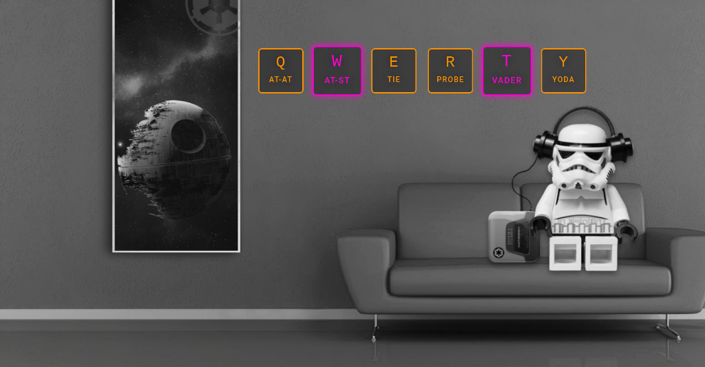

#### star_wars_keys



#### deployed @github - [link](https://tmsnvk.github.io/star_wars_keys/public/index.html)
#### deployed @heroku - [link](https://tmsnvk-starwarskeys.herokuapp.com/)
---

#### description
- a simple .js app that plays sounds after certain keydowns;
- keys are linked to audio files using the `data-key` attribute;
- in addition, the code toggles visual styles to make the keydowns visible as well;

#### project structure

```
*
|- .babelrc
|- .gitignore
|- index.js
|- license.md
|- package-lock.json
|- package.json
|- readme.md
|- screenshot.png
|- webpack.config.js
|- SRC
    |- AUDIO
        |- at-at.wav
        |- at-st.wav
        |- probe.wav
        |- tie.wav
        |- vader.wav
        |- yoda.wav
    |- HTML
        |- index.html
    |- IMG
        |- background.jpg
    |- JS
        |- app.js
        |- functions.js
    |- PUBLIC
        |- at-at.wav
        |- at-st.wav
        |- background.jpg
        |- index-bundle.js
        |- index.html
        |- probe.wav
        |- tie.wav
        |- vader.wav
        |- yoda.wav
    |- STYLES
        |- base.scss
        |- main.scss
        |- mediaq.scss
```